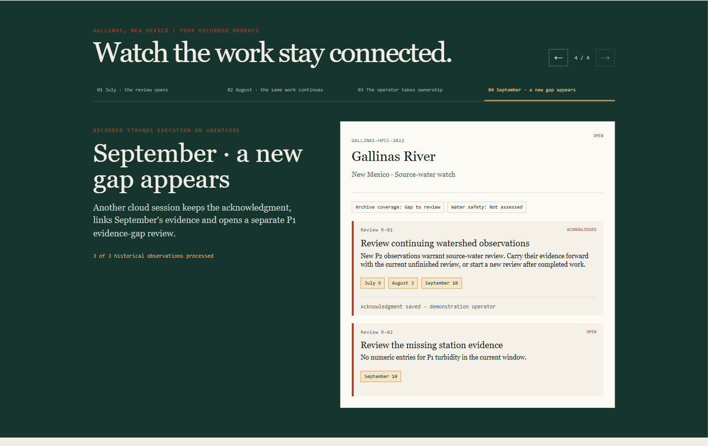

# Watershed Memory

## Three storms. One memory.

**A wildfire changes more than the landscape. It changes the work of protecting a drinking-water source.**

In July 2022, Las Vegas, New Mexico declared a disaster after flooding, ash and fire debris damaged infrastructure and threatened its water supply. Its water team had to keep monitoring an evolving watershed. [New Mexico Environment Department](https://www.env.nm.gov/wp-content/uploads/2022/08/2022-08-03-COMMS-City-of-Las-Vegas-drinking-water-remains-safe-to-drink-Final.pdf).

Every new observation arrives alongside earlier measurements, unfinished reviews and changing evidence coverage. The work has to stay connected from one storm to the next.

**Watershed Memory keeps that work connected.** One watershed case carries observations and operator responses forward. A later event strengthens an existing review; missing station evidence gets its own review. The next storm arrives. The work stays connected.

Built by **AIstanbul Research Group** for the **Agents for Humans Hackathon**, Professional Agents track.

**[Watch the verified cloud run](https://aistanbulresearch.github.io/watershed-memory/)** — four recorded moments, one enduring case, with the actual Strands tool receipts available to inspect.

[](https://aistanbulresearch.github.io/watershed-memory/#journey)

### Try the operator workspace

With [uv](https://docs.astral.sh/uv/) and Python 3.12:

```bash
git clone https://github.com/aistanbulresearch/watershed-memory.git
cd watershed-memory
uv sync --frozen
uv run watershed-memory
```

Open **http://127.0.0.1:8765**. The small historical observation bundle is included; the browser experience needs no AWS credentials or large download.

1. **Start the replay.** July observations create a source-water review.
2. **Bring in August.** The same unfinished review gains a second evidence link.
3. **Record an acknowledgment.** The operator's note stays with the work.
4. **Bring in September.** New observations join the case; absent P1 archive evidence opens a separate coverage review.
5. **Complete one review and reload.** The completed work, remaining review and saved response are still there.

The workspace identifies **historical replay · rules**. Operator responses are demonstration actions. The records are real SQLite writes; each browser replay has an independent case.

### The agent behind the case

The Strands integration exposes three bounded tools: read saved case context, retrieve a released observation window, and propose a review against an explicitly selected unfinished task. The service validates the work and its evidence before committing the turn. A model cannot write an operator response or declare the watershed recovered.

**Real Strands execution has passed all three feasibility cases:** unfinished work, acknowledged work with missing evidence, and new work after completion. The gate records tool choices, usage, duplicate handling and fresh-process persistence. [Run the Strands gate](docs/ENGINEERING.md#real-strands-gate).

**AgentCore runs the agent. The case carries the memory.** The verified cloud run uses two separate Runtime sessions: August continues the same review; September preserves its acknowledgment and opens a separate evidence-gap review. Both repeated requests return saved receipts without another invocation. The case restores identically in a fresh process. [Inspect the verified run](docs/VERIFIED_RUN.md) · [Explore the Runtime boundary](docs/AGENTCORE.md).

### Keep collecting while the operator is away

The current-observation collector checks official USGS rain, flow and turbidity on a saved schedule. It catches late publications within a configured lookback, preserves corrections and queues evidence for case assessment. Restarting keeps the same observations and pending work. **[Run the continuous watch](docs/CONTINUOUS_WATCH.md).**

This current collector performs acquisition without model calls. The browser and cloud walkthrough above demonstrate the separate verified historical agent journey.

### Engineering worth opening

- **One enduring case:** observations, reviews and operator responses stay connected across restarts.
- **Explicit agent decisions:** the agent selects the existing task from saved context; completed work is never reopened implicitly.
- **Atomic turns:** tools stage proposals; the complete validated turn commits together.
- **Execution claims:** concurrent duplicate requests share one planner execution, with a durable claim and replayable receipt.
- **A durable live allowance:** server restarts preserve the attempt counter; failures consume capacity and saved receipts do not.
- **Evidence checks:** unreleased observations are unavailable to tools; recorded results are checked against case and source packets.
- **Continuous acquisition:** bounded source reads, revision-linked evidence, exclusive poll leases and an indexed durable event queue.
- **An operator experience:** accessible actions, saved responses, contextual next steps, and evidence/trace panels on demand.

[Architecture](docs/ARCHITECTURE.md) · [Implementation and checks](docs/ENGINEERING.md) · [Interactive hosting](docs/HOSTING.md) · [Source attribution](THIRD_PARTY_NOTICES.md)

### Check it

```bash
uv run pytest -q
node --test tests/request-state.test.mjs
uv run ruff check watershed_memory tests runtime deployment feasibility/run_strands.py feasibility/run_agentcore.py feasibility/export_evidence.py
python -m unittest discover -s feasibility -p "test_*.py"
```

The Python suite covers the HTTP journey, isolation, failure atomicity, adversarial planner output, request claims, Strands/AgentCore protocols, public evidence export, durable invocation limits and explicit web exposure. Continuous-watch checks add source validation, corrections, restart recovery, 10,000-observation history and a 2,000-event queue. JavaScript request-state checks cover recovery after a lost response. The original proof remains reproducible, with **21 tests and 11 checks across eight fresh processes**. [Original replay guide](feasibility/README.md).

### License

[MIT](LICENSE) · Copyright 2026 AIstanbul Research Group. The included extract retains its [source attribution and CC BY 4.0 notice](watershed_memory/data/NOTICE.md).
