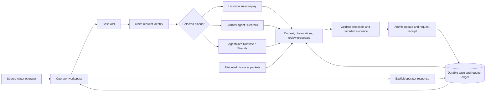

# From a changing river to a continuing field plan

Watershed Memory connects incoming station readings, unfinished reviews and
the team's field results. The case ledger carries that history into the next
agent decision and preserves the human actions that follow.

## Current observations and field work

The collector runs without model calls. The dispatcher admits meaningful
changes and scheduled checks to a bounded agent turn. Source and field tools
read the reserved context; the agent stages work, and the application validates
and commits it. Human corrections retain their own revisions and invalidate
proposals based on superseded context.

The working field desk supports approval, modification, deferral, cancellation,
results, evidence and verification. Its browser recovery tests exercise lost
confirmations and concurrent corrections. Separate installed-process tests run
the actual Strands and AgentCore SDKs with a handwritten model across successful,
failed, incomplete and stale outcomes. The current ARM64 Runtime package is
built and independently inspected; current real-model/cloud execution is the
next gate. The historical cloud execution below is already verified.

[Continuous collection](CONTINUOUS_WATCH.md) · [Selective dispatch](CURRENT_DISPATCH.md) ·
[Field work](FIELD_WORK.md) · [Current Runtime](CURRENT_RUNTIME.md)

## Verified historical cloud journey

The source-water case survives individual model calls, browser tabs and server restarts. An agent turn reads that case, selects evidence and proposes permitted work. The service checks the whole turn before saving it.

The default local workspace uses historical rules replay. Select Bedrock to run the Strands planner directly, or AgentCore to invoke a pinned Runtime endpoint. Every mode uses the same case service. Real execution has passed the direct Strands cases, the two-session AgentCore gate and the operator browser journey. The public walkthrough displays a labelled recording of that cloud gate. [Verified run](VERIFIED_RUN.md) · [Runtime boundary and deployment](AGENTCORE.md).

## Decision boundaries

| Boundary | Responsibility |
|---|---|
| Catalog | Pinned source windows, units and provenance; measurements released sequentially |
| Planner | Retrieve context/evidence and explicitly select a task or propose new work |
| Evidence tools | Check references, review kinds, expected coverage and existing targets |
| Case service | Independently revalidate proposals and recorded tool results |
| Request ledger | Claim work before inference; commit state and response receipt atomically |
| Operator | Acknowledge/complete a review with a note, separately from agent work |
| AgentCore adapter | Bind a turn to the reviewed Runtime version; validate the returned proposal and request hashes |
| HTTP boundary | Admit requests from configured hosts/origins within burst limits; project browser-safe execution receipts |

## Retry and restart

SQLite stores independent session snapshots, immutable request receipts and a durable per-session execution claim. The claim is acquired before planning, so a repeated concurrent request does not start another model turn. An active claim returns a retryable response; the client keeps the request identity. A commit requires the expected case revision and current claim owner.

A crashed process leaves a claim for up to five minutes. An expired claim can be replaced; the previous owner cannot later commit. Each turn is capped at eight model calls and 120 seconds, with provider timeouts. A committed request receipt prevents repeating the saved action.

The planner receives copies of case state and released packets. Tools stage proposals. The service builds the saved state itself: direct planner mutation, forged targets, missing actions and inconsistent tool results are rejected. Model/tool failure leaves the saved case unchanged.

The live workspace also keeps its invocation allowance in SQLite. An atomic reservation commits before the wrapped planner runs, so restarts and failed or interrupted calls cannot reset the counter. The transaction closes before inference. A previously committed request returns from the receipt ledger before it reaches this counter. Reopening an allowance with a changed limit is rejected; a new named allowance is an explicit operator configuration choice.

The HTTP layer has separate rolling-minute admission limits for session creation and all POSTs. These counters protect the current process; the SQLite invocation allowance persists across restarts. Public exposure requires explicit hosts, HTTPS origins and request limits before the CLI configures a planner. API projections preserve source/tool evidence and the operator's own response while omitting private Runtime transport identifiers. [Hosting contract](HOSTING.md).

## Memory across Runtime sessions

Each AgentCore turn starts a fresh Runtime session. Its input contains the released observation packets, existing tasks and operator action metadata. Operator notes and actor names stay in the local case ledger. The Runtime returns a proposal with its tool trace; the local service independently validates and commits it. A new Runtime session therefore picks up the work from the same durable case.

The transport binds the response to the request ID, case revision, state hash and released-evidence hash. It rejects oversized or malformed output, unexpected tool names, missing execution metadata and a changed Runtime endpoint version. The client requests session shutdown after each invocation and records whether that request was accepted. Saved receipts avoid invoking the Runtime again when the same completed request is retried.

## Implementation map

| Component | Source |
|---|---|
| Evidence and release boundaries | [catalog.py](../watershed_memory/catalog.py) |
| Tools and review policy | [planning.py](../watershed_memory/planning.py) |
| Strands and inference guards | [strands_agent.py](../watershed_memory/strands_agent.py) |
| Runtime request and response contract | [agentcore_protocol.py](../watershed_memory/agentcore_protocol.py) |
| Pinned Runtime invocation | [agentcore_client.py](../watershed_memory/agentcore_client.py) |
| Cloud entry point and artifact builder | [runtime](../runtime/) / [deployment](../deployment/) |
| Sessions, claims and receipts | [service.py](../watershed_memory/service.py) |
| Durable live invocation allowance | [persistent_budget.py](../watershed_memory/persistent_budget.py) |
| HTTP and static serving | [api.py](../watershed_memory/api.py) |
| Exposure, admission and browser projection | [public_http.py](../watershed_memory/public_http.py) |
| Operator experience | [static](../watershed_memory/static/) |
| Original reconciliation | [reconcile.py](../feasibility/reconcile.py) |
