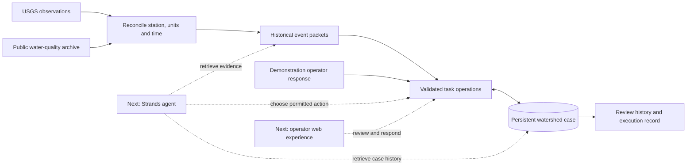

# How Watershed Memory keeps the case connected

The case is the durable center of the system. Observations become linked evidence; reviews and operator responses stay attached as later events arrive.

Solid paths are implemented in the current replay. Dashed paths identify the next product integrations.

## One case, successive events

The database stores the case, event packets, review tasks, links between tasks and evidence, and operator responses. Each incoming packet is validated before it can change state. Task updates and evidence links share a transaction.

The replay uses a separate process for each step. Persistence therefore comes from the case store and its records, rather than an open chat or a process that happens to remain alive.

## Tools do the bookkeeping; the agent will choose the work

The planned Strands loop will retrieve the relevant case history, inspect available observations, choose a permitted review action and produce a grounded explanation. The task layer enforces references, timing, allowed transitions and duplicate protection. Operator responses are explicit actions with their own record.

This gives the operator a clear path: **what changed, what remains open, and what to review next**.

## Where to look

| Component | Implementation |
|---|---|
| Source acquisition and checksums | [fetch_data.py](../feasibility/fetch_data.py) |
| Time, units and observation packets | [reconcile.py](../feasibility/reconcile.py) |
| Case state and task transactions | [workflow.py](../feasibility/workflow.py) |
| Process-separated replay | [run_proof.py](../feasibility/run_proof.py) |
| Failure and data checks | [test_workflow.py](../feasibility/test_workflow.py), [test_reconcile.py](../feasibility/test_reconcile.py) |
