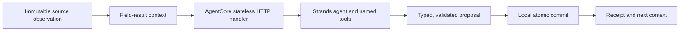

# Current-v3 Runtime path

Current-v3 carries the field record through a bounded review turn. The source
observation and the field result are assembled into an immutable, versioned
context before the model is called. A new Runtime session therefore receives
the same attributable history instead of starting with an empty prompt.

## Request and commit path



The local case service reserves one attempt and selects the exact context for
that attempt. The context includes source identity, observation timing,
coverage and freshness, the relevant field plan and result revisions, and the
request identity. Its encoded form is canonical and digest-bound; changing a
source, field result, plan revision or request identity produces a different
context.

One Strands agent uses the current tool set to inspect that context, compare an
earlier event, locate relevant reviews and stage an assessment. Tools return
structured values with explicit missing and unavailable states. The agent
prepares a proposal; it does not write the local case ledger.

The AgentCore handler is stateless between HTTP sessions. `runtime/current_launch.py`
starts the pinned OpenTelemetry launcher and always targets the sibling
`current_entrypoint.py`. The entrypoint creates the current production app;
the caller cannot select another script through an argument or environment
value.

The remote protocol accepts only the canonical request envelope and returns a
typed execution or typed failure. The client checks request identity, context
digest, response digest, proposal fields and all referenced evidence before
accepting the result. A transport uncertainty remains an explicit unknown
outcome and is never converted into a successful assessment.

After validation, the local service commits the proposal, receipt and case
revision in one database transaction, preventing a partially saved turn.
Retrying an already completed request returns its saved
receipt without invoking the agent again.

## Human authority and stale correction

The agent can recommend a review, continuation or no follow-up. A person owns
the plan: approval, modification, deferral, cancellation, reported outcome,
evidence attachment and verification are attributed human actions in the
field ledger. An acknowledgement is carried into later context as a recorded
fact, never as model-authored text.

Plans, reports and evidence references are revisions. A correction creates a
new report revision while retaining the earlier account and its verification.
The commit boundary checks the expected case revision and exact parent
identities. A stale browser form, an outdated proposal or a result tied to a
closed plan cannot overwrite newer work. The resulting history shows both
what was known earlier and what is current now.

See the [field ledger](FIELD_WORK.md), [current agent](CURRENT_AGENT.md),
[field context](FIELD_CONTEXT.md), and [current delivery](CURRENT_DELIVERY.md)
for the related contracts and operator flow.

Implementation entry points: [context wire format](../watershed_memory/current/context_wire.py),
[remote protocol](../watershed_memory/current/remote_protocol.py),
[AgentCore planner](../watershed_memory/current/field_agentcore.py),
[field store](../watershed_memory/current/field_store.py), and
[current entrypoint](../runtime/current_entrypoint.py).

## Build the current artifact

Build from the checked-in current source inventory and the prepared Linux ARM64
dependency directory:

```bash
uv run python -m deployment.build_current_runtime --dependencies PATH_TO_ARM64_DEPS --output build/current-runtime.zip
```

The fixed [current inventory](../deployment/current_sources.json) selects the
current launcher and the complete application package. The output path must be
new; the builder writes an adjacent manifest with the hash and size of every file.

The current package is an explicit public source inventory. `build_package`
does not recursively collect application files: the reviewed source tuple is
checked for canonical ASCII POSIX names, duplicate aliases, private names,
package shadowing and link or junction indirection. Dependencies are checked
against the same archive namespace and every selected byte is re-read while
the ZIP is constructed.

The output is a new Python 3.12 Linux ARM64 CodeZip with a per-entry manifest.
The runtime launcher and entrypoint are selected explicitly for current-v3;
the historical `SOURCE_FILES` inventory and command-line default remain the
historical path. The artifact includes the Strands/runtime code, typed current
protocol, AWS OpenTelemetry distribution and reviewed notices. The case
database, credentials and private director material stay outside it. The
browser and case service run separately; the archive also contains the
package's static assets.

## Render and provision

Render the reviewed current plan with the fixed current planner, then pass the
same artifact and specification through the explicit provisioning phases:

```bash
uv run python -m deployment.provision render \
  --runtime-mode current-v3 --spec SPEC.json --artifact CURRENT.zip \
  --deadline YOUR_REVIEWED_ISO8601_DEADLINE
```

The `current-v3` mode requires the separate current resource prefix. It binds
the content-addressed artifact, exact model and region permissions, and the
fixed current launcher. The endpoint name is `current_v3`; historical mode
continues to use its existing default and endpoint namespace. Each phase is
explicit and journaled, with the returned Runtime version required before
creating the named endpoint.

Each phase checks its prerequisites: account and artifact identity throughout,
role and bucket controls before Runtime creation, and Runtime readiness and
configuration before endpoint creation. If the metadata phase updates MMDSv2,
AWS creates a newer Runtime version. Use the latest version returned by either
Runtime creation or that metadata update, and successfully inspect it before
creating the endpoint. Inspect the endpoint again before an invocation.
Current-v3 remains a separate admission
path; choosing it does not repoint the historical Runtime.

## Evidence and checks

### Verified current execution

On September 14, 2026, the field-aware current-v3 workflow completed against
the real `us.amazon.nova-2-lite-v1:0` provider in two forms: one direct
Bedrock Strands execution and one AgentCore Runtime execution. Both turns read
the same saved case, inspected its source and field records, continued the
existing review and committed an unapproved follow-up proposal for a verified
partial field result. The AgentCore response was validated against Runtime
version `1` and endpoint qualifier `current_v3`; its session stop was accepted.

Both executions passed all nine independent result checks, including attempt
count, provider allowance, immutable readings, saved-receipt replay and the
human approval boundary. The proposal remained `PROPOSED`; no approval or
field visit is claimed. See the [current verified run](CURRENT_VERIFIED_RUN.md)
and its [public evidence record](evidence/current-agentcore-run.json).

### Contract checks

Run the focused local contract checks with an environment that has the locked
AWS and OpenTelemetry dependencies:

```bash
uv run --locked pytest tests/test_current_deployment.py tests/test_current_provision.py -q
```

The local AgentCore SDK and Strands exercise uses a handwritten model and has
passed in a separate HTTP process for successful execution, typed failure,
incomplete result and stale correction branches. Those controlled tests remain
distinct from the real-model executions above. The accepted ARM64 ZIP contains
125 application files and 5,540 dependency files; the installed package suite
passed 216 tests before the verified run.

The historical real AgentCore execution is documented in the
[verified run](VERIFIED_RUN.md). It records two Runtime sessions continuing
one case, preserving human acknowledgement, suppressing duplicate requests
and restoring the case in a fresh process. The [AgentCore boundary guide](AGENTCORE.md)
explains that historical proof and the shared external case ledger.
